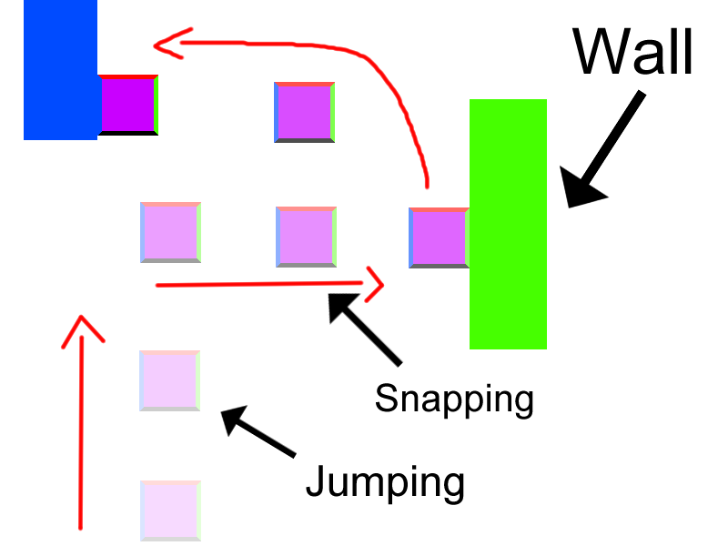

# GDD 2D Game: Speed Stick

## Contents
- [1. Game Development Team](#_toc198658429)
  - [1.1. Game Designers](#_toc198658430)
- [2. Game Concept](#_toc198658431)
- [3. Game Mechanics](#_toc198658432)
  - [3.1. Cube Sides](#_toc198658433)
  - [3.2. Jumping](#_toc198658434)
  - [3.3. Snapping](#_toc198658435)
- [4. Walls](#_toc198658436)
  - [4.1. Colored Walls](#_toc198658437)
  - [4.2. Neutral Walls](#_toc198658438)
- [5. Power Ups](#_toc198658439)
  - [5.1. Double Jump](#_toc198658440)
  - [5.2. Wall Break](#_toc198658441)
  - [5.3. Wall Jump](#_toc198658442)

---

## 1. Game Development Team

### 1.1. Game Designers
- Hassan Sharif Abbud Gonzalez

---

## 2. Game Concept

**Speed Stick** is a 2D up-scroller game where you must climb levels upward against a timer. The player will have tools at their disposal to reach certain platforms, but the main mechanic is jumping and sticking to walls that match the color of the cube’s side.

---

## 3. Game Mechanics

### 3.1. Cube Sides
Each side of the player's cube will have a different color. These colors match the colors of walls in the level. The player can rotate the cube in any direction, similar to how pieces are rotated in *Tetris*.

### 3.2. Jumping
The main method of movement. The player will be able to jump and move left or right to reach platforms and progress through the level.

### 3.3. Snapping
When the cube’s side color matches a wall’s color, the player can press toward the wall to snap into it and regain the ability to jump again.

  

---

## 4. Walls

### 4.1. Colored Walls
These walls allow the player to stick to them if the cube’s corresponding side matches their color. Otherwise, the cube will slide down.

### 4.2. Neutral Walls
Neutral-colored walls act as obstacles. The player cannot stick to them under normal conditions. See [5. Power Ups](#_toc198658439) for exceptions.

---

## 5. Power Ups

### 5.1. Double Jump
Allows the player to jump a second time while mid-air.

### 5.2. Wall Break
Allows the player to break the next wall they come into contact with — useful for accessing hidden or blocked areas.

### 5.3. Wall Jump
Allows the player to bounce off a neutral wall that would otherwise be non-interactive.

